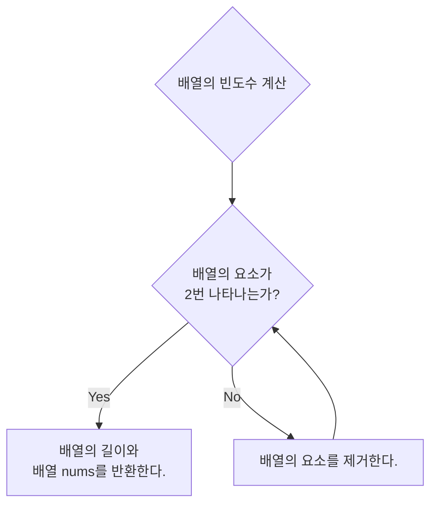

```mermaid
flowchart TD
    case0{"배열의 빈도수 계산"}
    case1{"배열의 요소가<br>2번 나타나는가?"}
    result1["배열의 길이와<br>배열 nums를 반환한다."]
    result2["배열의 요소를 제거한다."]
    case0 --> case1
    case1 -- Yes --> result1
    case1 -- No --> result2
    result2 --> case1
```